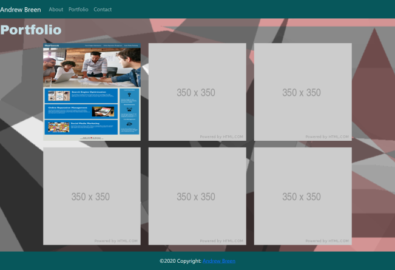
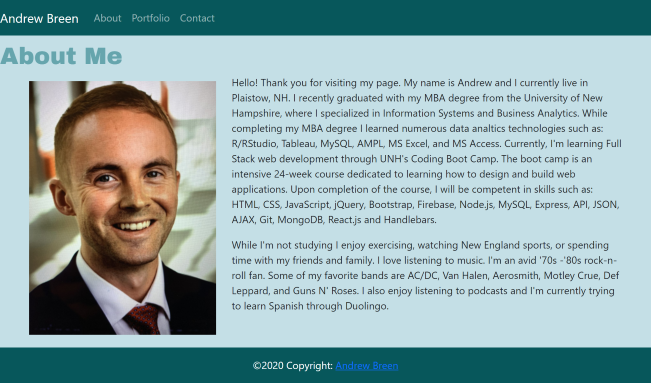
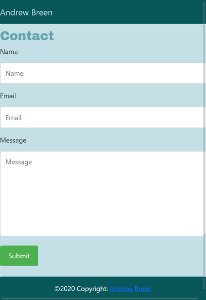

# Responsive-Portfolio

## Project-Description

This project was a homework assignment designed to simulate a client asking me to create a mobile-first application or add responsive design to an existing application. In this case, I was tasked with creating a mobile responsive portfolio using the Bootstrap CSS Framework. The directions given to me by my instructors were as follows:

* Create the following files files: `index.html`, `portfolio.html` and `contact.html`.

* Using Bootstrap, develop your portfolio site with the following items:

   * A navbar

   * A responsive layout

   * Responsive images

* The Bootstrap portfolio should minimize the use of media queries.

### Minimum Requirements

* Functional, deployed application

* GitHub repository with README describing the project

* Navbar must be consistent on each page.

* Navbar on each page must contain links to Home/About, Contact, and Portfolio pages.

* All links must work.

* Must use semantic html.

* Each page must have valid and correct HTML. (use a validation service)

* Must contain your personalized information. (bio, name, images, links to social media, etc.)

* Must properly utilize Bootstrap components and grid system.

## Installation

No installation required for this project as each file was created from scratch. Bootstrap can be downloaded for free at [getbootstrap.com] (https://getbootstrap.com/). All code was edited by using [Visual Studio Code](https://code.visualstudio.com/download) which is free to download. 

## Usage

The purpose of this assignment was for me to understand how to create a mobile-first application or how to add responsive design to an existing application. If you wish to use this project to test your mobile-first application knowledge, simply follow the instructions in the Project Description section. The finished product does not need to direclty match mine. Website design is completely up to the developer, but it must meet the minumum functionality requirements.

## Mock-Up

Note: Since I am new to web development, I was only able to complete the About page with my own information. Currently, I only have one other repository that I would put in a portfolio page and it looked a little bland with just one image. So for now, I'm going to leave the placeholder images in and as I complete more projects I will update the page. Below are screenshots of the responsive view for each page. To view how the application looks on a mobile device go to the [assets](./assets/images) folder.

## Credits

A lot of the knowledge on how to do this assigment came from class instruction, but I also consulted W3 schools a lot for this project. I used [W3 Schools'](https://www.w3schools.com/howto/howto_css_contact_form.asp) article on how to create a contact form, we well as [W3 Schools'](https://www.w3schools.com/bootstrap/bootstrap_navbar.asp) article on how to create a navbar using Bootstrap. Also, [Canva](https://www.canva.com/learn/100-color-combinations/) was a great resource when I was choosing a color scheme. 

## Tests

To test my html and css files, I used W3C's [Markup Validation Service](https://validator.w3.org/#validate_by_input) and their [CSS Validation Service](https://jigsaw.w3.org/css-validator/#validate_by_input). These services are free and easy to use. To use both, you simply copy and paste your code into the respective input boxes. 

## License

Licensed under the [MIT](./assets/LICENSE.txt) license.